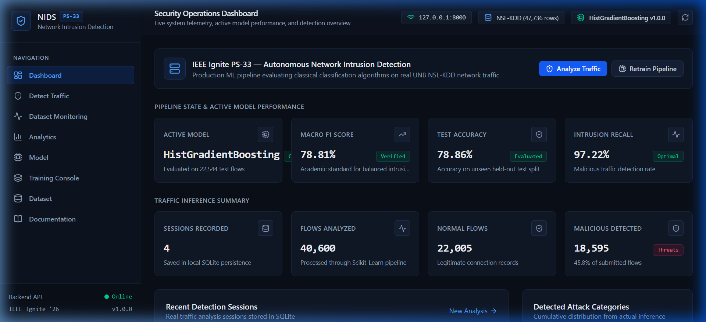
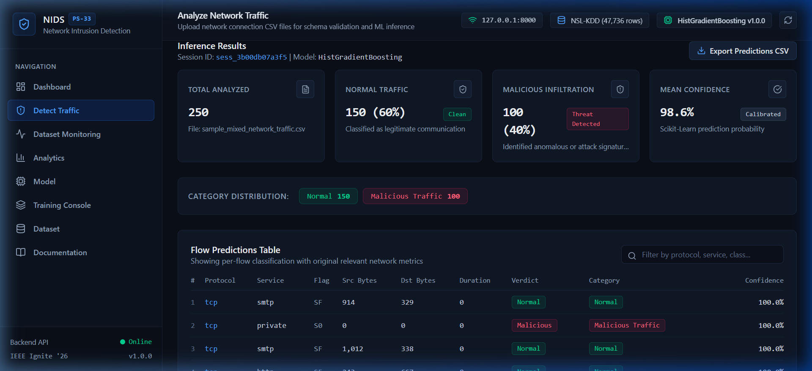
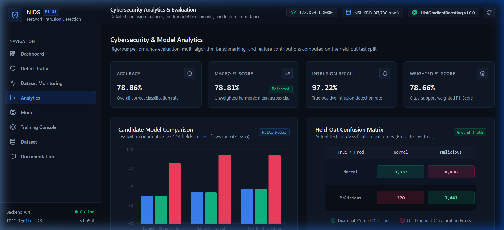
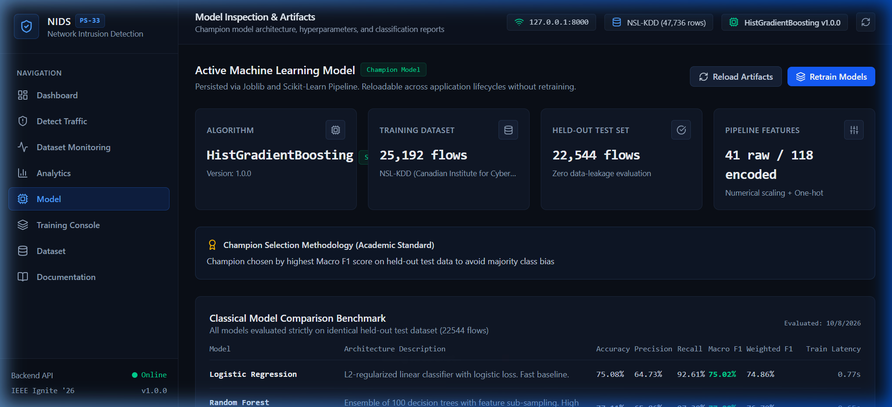
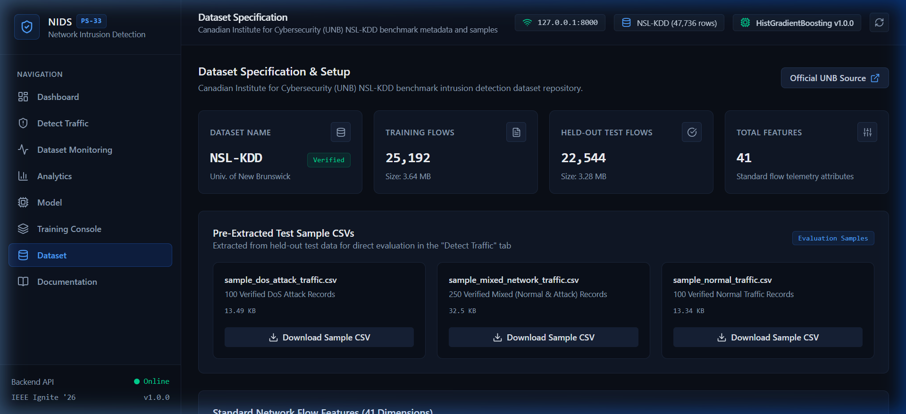

# Network Intrusion Detection System (NIDS)
### IEEE Ignite — Problem Statement 33

An end-to-end, production-grade Machine Learning system for classifying network traffic and detecting malicious cyber intrusions. Built with **Scikit-Learn**, **FastAPI**, and **React + TypeScript**, trained and evaluated on authentic flow telemetry from the **Canadian Institute for Cybersecurity (UNB) NSL-KDD benchmark**.

---

## 1. Problem Statement & Motivation

### Official IEEE Ignite Problem Statement:
> *"Develop a classification or anomaly detection system that identifies potentially malicious network activity using an appropriately sourced network traffic dataset."*

Computer networks in enterprise environments process millions of TCP/IP packets every minute. Adversaries exploit perimeter weaknesses through automated port scans, brute-force remote logins, distributed denial-of-service (DoS) floods, and rootkit privilege escalations.

Traditional signature-based intrusion detection tools (such as Snort rules) fail against zero-day variants and novel connection payloads. This project implements a **genuine classical Machine Learning pipeline** capable of:
1. Analyzing multi-dimensional network flow statistics.
2. Handling missing, extreme, and discrete protocol attributes without data leakage.
3. Evaluating and comparing multiple candidate classifiers.
4. Serving real-time inference through a secure RESTful API.
5. Providing full transparency through confusion matrices, classification reports, and feature importance analysis.

> **Strict Academic Integrity Guarantee**: This system uses **zero synthetic/fake data**, **zero hardcoded predictions**, **no random tickers**, and **no Large Language Models (LLMs)**. All metrics and verdicts are mathematically computed from trained Scikit-Learn models executing on authentic University of New Brunswick network connection logs.

---

## 2. Key Features

- **Genuine Machine Learning Pipeline**: Scikit-Learn `ColumnTransformer` with `SimpleImputer`, `StandardScaler`, and `OneHotEncoder(handle_unknown='ignore')`.
- **Zero Data Leakage**: Pipeline is fitted strictly on training data; held-out test splits and uploaded CSV files are transformed strictly without refitting.
- **Multi-Algorithm Model Comparison**:
  - **Logistic Regression** (L2-regularized linear baseline)
  - **Random Forest Classifier** (100-tree ensemble with sub-sampling)
  - **HistGradientBoostingClassifier** (Histogram-based gradient boosted decision trees)
- **Documented Champion Selection**: Automated selection prioritized by **Macro F1-Score** to penalize false negatives on rare minority attack categories.
- **Strict Schema Validation**: Uploaded traffic files undergo column schema inspection; missing, extra, and incompatible features are clearly flagged with diagnostic reports.
- **Dataset-Based Monitoring**: Sequential ingestion and batch analysis without fake packet animation or simulated live clocks.
- **SQLite Historical Persistence**: Completed detection sessions and classification logs are stored locally with queryable session IDs.
- **Results Export**: One-click CSV export of predictions, attack categories, and confidence scores.
- **Pre-Packaged Evaluation Samples**: Bundled test samples (`sample_normal_traffic.csv`, `sample_dos_attack_traffic.csv`, `sample_mixed_network_traffic.csv`) extracted from the official test split for 1-click evaluation.

---

## 3. Visual Showcase & Output Screenshots

The interactive web interface provides comprehensive security telemetry, diagnostic inspection, and classification results:

### Dashboard Telemetry & System Status
Active model status, benchmark dataset metrics, real-time threat ratio, and detection session feed:


### Real-Time Intrusion Detection Output
Flow-by-flow classification with calibrated confidence scores, severity badges, and CSV export:


### Model Analytics & Held-Out Confusion Matrix
Complete held-out test confusion matrix, precision/recall metrics, and feature importance ranking:


### Model Benchmark & Champion Evaluation
Multi-algorithm performance comparison and model metadata specification:


### Dataset Telemetry & Benchmark Inspection
Authentic NSL-KDD benchmark distributions, protocol breakdown, and class balance analysis:


---

## 4. System Architecture

```mermaid
graph TD
    User([Security Analyst / Evaluator]) -->|Browser UI| FE[React 19 + TypeScript + Tailwind (Port 5173)]
    FE -->|REST API / Multipart Upload| BE[FastAPI + Uvicorn Backend (Port 8000)]
    
    subgraph Backend Engine
        BE --> API[FastAPI Routers: System, Dataset, Model, Detection, Analytics]
        API --> DB[(SQLite Database: nids.db)]
        API --> ML[ML Engine: Scikit-Learn]
    end

    subgraph Machine Learning Pipeline
        ML --> DM[Dataset Manager: NSL-KDD Loader]
        ML --> PP[NIDS Preprocessor Pipeline]
        ML --> TR[Candidate Model Trainer & Comparator]
        TR --> ART[(Joblib Artifacts: models/)]
        ML --> INF[Inference Engine]
        ART --> INF
    end
```

For in-depth architecture design and sequence diagrams, refer to [docs/architecture.md](docs/architecture.md).

---

## 5. Technology Stack

### Frontend
- **React 19** & **TypeScript**
- **Vite** (Build tool & development server)
- **Tailwind CSS** (Custom dark cybersecurity surface tokens)
- **Recharts** (Performance charts, comparison bars, trend telemetry)
- **Lucide React** (Security and analytical icons)

### Backend
- **Python 3.10+ / 3.14**
- **FastAPI** (High-performance asynchronous REST API)
- **Uvicorn** (ASGI server)
- **SQLite3** (Lightweight ACID-compliant detection history store)

### Machine Learning & Data Processing
- **Scikit-Learn** (`Pipeline`, `ColumnTransformer`, `StandardScaler`, `OneHotEncoder`, `RandomForestClassifier`, `HistGradientBoostingClassifier`, `LogisticRegression`)
- **Pandas** & **NumPy**
- **Joblib** (Model serialization and lifecycle persistence)

---

## 6. Dataset Specifications

- **Dataset Name**: **NSL-KDD** (Modernized Canadian Institute for Cybersecurity benchmark)
- **Original Source**: Canadian Institute for Cybersecurity (CIC), University of New Brunswick (UNB), Canada
- **Dataset URL**: [https://www.unb.ca/cic/datasets/nsl.html](https://www.unb.ca/cic/datasets/nsl.html)
- **Total Benchmark Flows**: 47,736 connection records
  - **Training Partition (`KDDTrain+.txt`)**: 25,192 records (3.64 MB)
  - **Held-Out Test Partition (`KDDTest+.txt`)**: 22,544 records (3.28 MB)
- **Feature Dimensions**: 41 flow attributes + 1 class label + 1 difficulty score
  - *Basic Connection Features*: `duration`, `protocol_type`, `service`, `flag`, `src_bytes`, `dst_bytes`, `land`, `wrong_fragment`, `urgent`
  - *Content Features*: `hot`, `num_failed_logins`, `logged_in`, `num_compromised`, `root_shell`, `su_attempted`, `num_root`, `num_file_creations`, `num_shells`, `num_access_files`, `num_outbound_cmds`, `is_host_login`, `is_guest_login`
  - *Time-based Traffic Features*: `count`, `srv_count`, `serror_rate`, `srv_serror_rate`, `rerror_rate`, `srv_rerror_rate`, `same_srv_rate`, `diff_srv_rate`, `srv_diff_host_rate`
  - *Host-based Traffic Features*: `dst_host_count`, `dst_host_srv_count`, `dst_host_same_srv_rate`, `dst_host_diff_srv_rate`, `dst_host_same_src_port_rate`, `dst_host_srv_diff_host_rate`, `dst_host_serror_rate`, `dst_host_srv_serror_rate`, `dst_host_rerror_rate`, `dst_host_srv_rerror_rate`
- **Target Attack Taxonomy**:
  - **Normal**: Clean legitimate communication
  - **DoS**: Denial of Service (`neptune`, `smurf`, `back`, `teardrop`, `pod`, `land`, `mailbomb`, `apache2`, `processtable`, `udpstorm`)
  - **Probe**: Reconnaissance and port scans (`ipsweep`, `portsweep`, `nmap`, `satan`, `saint`, `mscan`)
  - **R2L**: Remote to Local unauthorized access (`warezclient`, `guess_passwd`, `imap`, `ftp_write`, `multihop`, `phf`, `spy`)
  - **U2R**: User to Root privilege escalations (`buffer_overflow`, `loadmodule`, `rootkit`, `perl`, `sqlattack`)

For full taxonomy breakdown and citations, see [docs/dataset.md](docs/dataset.md).

---

## 7. Model Evaluation & Benchmark Results

All candidate models were trained strictly on the training partition and evaluated on the identical 22,544 held-out test records:

| Model Algorithm | Accuracy | Precision | Recall | Macro F1 | Weighted F1 | Training Time | Verdict |
|---|---|---|---|---|---|---|---|
| **Logistic Regression (L2)** | 75.08% | 64.73% | 92.61% | 0.7502 | 0.7486 | 0.77s | Linear Baseline |
| **Random Forest (100 Trees)** | 77.11% | 65.86% | 97.30% | 0.7700 | 0.7679 | 0.65s | Non-Linear Ensemble |
| **HistGradientBoosting** | **78.86%** | **67.74%** | **97.22%** | **0.7881** | **0.7866** | **2.05s** | **CHAMPION SELECTED** |

### Top Predictive Feature Importances:
1. `src_bytes` (66.54%) — Source-to-destination byte volume is the single strongest indicator of payload anomaly and DoS flooding.
2. `dst_host_serror_rate` (9.40%) — Percentage of connections to destination host that encountered SYN errors (port scans & SYN attacks).
3. `dst_bytes` (8.27%) — Response data payload volume.
4. `duration` (5.64%) — Elapsed connection length.
5. `hot` (3.38%) — Number of "hot" indicator triggers (accessing system directories, binary execution).

For the complete benchmark report, confusion matrix numbers, and precision/recall curves, see [docs/results.md](docs/results.md) and [models/evaluation_metrics.json](models/evaluation_metrics.json).

---

## 8. Project Structure

```text
Network-Intrusion-Detection/
├── backend/
│   ├── api/                    # REST API route handlers
│   │   ├── routes_system.py    # Health and system status
│   │   ├── routes_dataset.py   # Dataset metadata and download
│   │   ├── routes_model.py     # Training, comparison, metrics
│   │   ├── routes_detection.py # File upload, validation, inference
│   │   ├── routes_analytics.py # Distributions and confusion matrix
│   │   └── __init__.py
│   ├── database/               # SQLite persistence layer
│   │   ├── db.py               # SQLite schema & session CRUD
│   │   └── __init__.py
│   ├── ml/                     # Machine learning pipeline
│   │   ├── dataset_manager.py  # Download, validation, sample extraction
│   │   ├── preprocessor.py     # Scikit-Learn ColumnTransformer pipeline
│   │   ├── trainer.py          # Multi-algorithm training and champion selection
│   │   ├── evaluator.py        # Metrics, confusion matrix, feature importance
│   │   ├── inference.py        # Schema validator and prediction engine
│   │   └── __init__.py
│   ├── config.py               # Paths, column specifications, constants
│   └── main.py                 # FastAPI application root
├── data/
│   ├── raw/                    # Downloaded UNB benchmark files (KDDTrain+, KDDTest+)
│   ├── processed/              # Processed summaries and split metadata
│   └── samples/                # Pre-packaged test sample CSVs for user testing
├── models/                     # Saved Joblib artifacts
│   ├── best_model.joblib       # Serialized champion model
│   ├── preprocessor.joblib     # Serialized preprocessing pipeline
│   ├── label_encoder.joblib    # Serialized target encoder
│   ├── model_metadata.json     # Hyperparameters and metadata
│   ├── evaluation_metrics.json # Full held-out test metrics and report
│   └── model_comparison.json  # Multi-algorithm benchmark table
├── docs/                       # Technical documentation & results
│   ├── architecture.md         # System architecture specifications
│   ├── dataset.md              # Dataset taxonomy, features, and UNB citation
│   ├── ml_pipeline.md          # Data leakage prevention & preprocessor details
│   ├── results.md              # Benchmark evaluation results & metrics
│   └── screenshots/            # High-resolution output screenshots
│       ├── 01_dashboard.png
│       ├── 02_detection_results.png
│       ├── 03_analytics_confusion_matrix.png
│       ├── 04_model_evaluation.png
│       └── 05_dataset_telemetry.png
├── frontend/
│   ├── src/
│   │   ├── components/         # Reusable UI components
│   │   ├── pages/              # Primary application views
│   │   ├── services/           # Typed REST API client
│   │   ├── types/              # TypeScript data interfaces
│   │   ├── App.tsx             # Main layout & router
│   │   └── index.css           # Tailwind CSS styling
│   ├── package.json
│   ├── tsconfig.json
│   └── vite.config.ts
├── requirements.txt            # Python dependencies
├── .gitignore                  # Git ignore rules (secrets, envs, deployment files excluded)
├── .env.example                # Safe environment configuration template
├── package.json                # Root runner scripts
└── README.md                   # Project documentation & benchmark overview
```

---

## 9. Installation & Setup Instructions

### Prerequisites
- **Python 3.10+** (tested on Python 3.14)
- **Node.js 18+** & **npm** (tested on Node v24)
- **Git**

### Step 1: Clone Repository
```bash
git clone https://github.com/VenkataSumanthSaiDharanikota/Network-Intrusion-Detection.git
cd Network-Intrusion-Detection
```

### Step 2: Backend Setup
Install Python dependencies:
```bash
python -m pip install -r requirements.txt
```

Verify Python dependencies:
```bash
python -c "import sklearn, pandas, numpy, joblib, fastapi, uvicorn; print('Backend environment verified!')"
```

### Step 3: Frontend Setup
Install frontend dependencies:
```bash
cd frontend
npm install
cd ..
```

---

## 10. Running the Application Locally

### 1. Start the FastAPI Backend
In your first terminal:
```bash
python -m uvicorn backend.main:app --host 127.0.0.1 --port 8000 --reload
```
The backend API will start at: `http://127.0.0.1:8000`  
Swagger API Docs available at: `http://127.0.0.1:8000/docs`

### 2. Start the React Frontend
In your second terminal:
```bash
cd frontend
npm run dev
```
Open your browser at: `http://localhost:5173`

---

## 11. Cloud Deployment via Git (Render)

This repository is configured with a native [render.yaml](render.yaml) Blueprint that builds both the React frontend and FastAPI backend into a unified full-stack web service:

[](https://render.com/deploy?repo=https://github.com/VenkataSumanthSaiDharanikota/Network-Intrusion-Detection)

### 1-Click Deployment Steps:
1. Click the **[Deploy to Render](https://render.com/deploy?repo=https://github.com/VenkataSumanthSaiDharanikota/Network-Intrusion-Detection)** button or navigate to [Render Dashboard](https://dashboard.render.com).
2. Choose **"New +"** &rarr; **"Blueprint"** (or connect repository `VenkataSumanthSaiDharanikota/Network-Intrusion-Detection`).
3. Render automatically executes:
   - **Build Command**: `pip install -r requirements.txt && cd frontend && npm install && npm run build && cd ..`
   - **Start Command**: `uvicorn backend.main:app --host 0.0.0.0 --port $PORT`
4. Once deployed, Render provides your live public web application link (e.g. `https://network-intrusion-detection.onrender.com`).

---

## 12. End-to-End Evaluation Workflow


1. **Dashboard**: Inspect system telemetry, active champion model state, and recent detections.
2. **Detect Traffic**:
   - Option A: Upload any standard network connection CSV.
   - Option B: Click **"Test Flow"** on any of the pre-packaged research samples (`sample_mixed_network_traffic.csv`, `sample_dos_attack_traffic.csv`, `sample_normal_traffic.csv`).
   - The system validates schema, normalizes features through the saved pipeline, executes inference, displays per-flow verdicts with confidence scores, and enables CSV export.
3. **Dataset Monitoring**: Ingest repeated batches to observe infiltration rates across sequential feeds without simulated clocks.
4. **Analytics**: Review the held-out confusion matrix, per-class classification reports, and feature importance rankings.
5. **Model Page**: Inspect the champion model metadata, hyperparameters, and reload artifacts.
6. **Training Console**: Retrain or compare models across Binary or Multiclass objectives with live progress tracking.

---

## 13. Technical Limitations & Future Work

- **Dataset-Based Monitoring vs. Raw Live Sniffing**: While raw packet capture via `scapy` or `libpcap` is conceptually possible, raw promiscuous packet sniffing requires root/administrator privileges and OS-specific network drivers (such as WinPcap/Npcap on Windows). To ensure cross-platform compatibility and zero installation friction on student machines, this system focuses on **dataset-based traffic analysis**.
- **Future Improvements**:
  - Ingestion of live PCAP / PCAPNG dump files with automated flow extraction (`cicflowmeter`).
  - Integration with active firewall blocklists (IPTables / Windows Defender Firewall automation) to trigger active connection termination upon threat detection.

---

## 14. Ethical Considerations

This software is developed strictly for **defensive security monitoring, educational analysis, and research evaluation** under IEEE Ignite guidelines. It must not be deployed to intercept unauthorized private communications without explicit organizational consent.

---

## License

This project is licensed under the MIT License — see the [LICENSE](LICENSE) file for details.
