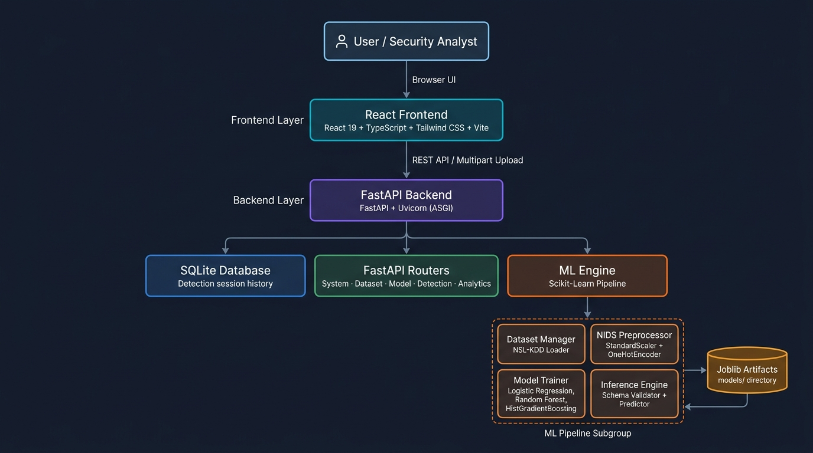

# Network Intrusion Detection System (NIDS)
### IEEE Ignite — Problem Statement 33

An end-to-end Machine Learning system for classifying network traffic flows and identifying malicious cyber intrusions. Built with **Scikit-Learn**, **FastAPI**, and **React + TypeScript**, trained and evaluated on network connection records from the **Canadian Institute for Cybersecurity (UNB) NSL-KDD benchmark**.

---

## 1. Problem Statement & Motivation

### Official IEEE Ignite Problem Statement:
> *"Develop a classification or anomaly detection system that identifies potentially malicious network activity using an appropriately sourced network traffic dataset."*

Computer networks process large volumes of TCP/IP connections, exposing infrastructure to port scans, brute-force remote logins, Denial of Service (DoS) attacks, and unauthorized privilege escalation. Traditional signature-based detection systems often struggle to identify novel attack variants or multi-stage intrusions without pre-configured rules.

This project implements a machine learning pipeline capable of:
1. Analyzing multi-dimensional network flow statistics.
2. Handling missing values and categorical protocol attributes without data leakage.
3. Training, evaluating, and comparing multiple candidate classifiers.
4. Serving inference through a RESTful API.
5. Providing model transparency through confusion matrices, classification reports, and feature importance analysis.

> **Technical Note on Evaluation**: The models are trained and evaluated on the NSL-KDD benchmark dataset without mocked predictions or simulated classification metrics. All reported results, confusion matrices, and feature importances reflect outputs from Scikit-Learn models evaluated on held-out test data.

---

## 2. Key Features

- **Scikit-Learn Preprocessing Pipeline**: Implements `ColumnTransformer` with `SimpleImputer`, `StandardScaler`, and `OneHotEncoder(handle_unknown='ignore')`.
- **Data Leakage Prevention**: Preprocessing transformers are fitted strictly on the training partition; test data and uploaded inference files are transformed using the fitted pipeline without refitting.
- **Multi-Algorithm Model Comparison**:
  - **Logistic Regression** (L2-regularized linear baseline)
  - **Random Forest Classifier** (100-tree ensemble with sub-sampling)
  - **HistGradientBoostingClassifier** (Histogram-based gradient boosted decision trees)
- **Champion Model Selection**: Candidate models are compared and selected using **Macro F1-Score** to account for class imbalance across attack categories.
- **Input Schema Validation**: Uploaded CSV files are inspected against the required 41 network flow features, providing clear diagnostic feedback for missing or mismatched columns.
- **Dataset-Based Monitoring**: Sequential ingestion and batch analysis across recorded network connection logs (does not require OS-specific packet capture drivers or administrator privileges).
- **SQLite Persistence**: Detection sessions and classification summaries are stored locally in SQLite with queryable session records.
- **CSV Export**: Export detection results, predicted labels, attack categories, and confidence scores to CSV.
- **Evaluation Samples**: Includes pre-packaged test samples (`sample_normal_traffic.csv`, `sample_dos_attack_traffic.csv`, `sample_mixed_network_traffic.csv`) extracted from the test partition for testing in the web UI.

---

## 3. Visual Showcase & Output Screenshots

The interactive web interface provides comprehensive security telemetry, diagnostic inspection, and classification results:

### Dashboard Telemetry & System Status
Active model status, benchmark dataset metrics, real-time threat ratio, and detection session feed:


### Real-Time Intrusion Detection Output
Flow-by-flow classification with calibrated confidence scores, severity badges, and CSV export:


### Model Analytics & Held-Out Confusion Matrix
Complete held-out test confusion matrix, precision/recall metrics, and feature importance ranking:


### Model Benchmark & Champion Evaluation
Multi-algorithm performance comparison and model metadata specification:


### Dataset Telemetry & Benchmark Inspection
Authentic NSL-KDD benchmark distributions, protocol breakdown, and class balance analysis:


---

## 4. System Architecture



For detailed architecture documentation and component interactions, refer to [docs/architecture.md](docs/architecture.md).

---

## 5. Technology Stack

### Frontend
- **React 19** & **TypeScript**
- **Vite** (Build tool and development server)
- **Tailwind CSS** (Cybersecurity dashboard UI styling)
- **Recharts** (Performance charts and telemetry visualization)
- **Lucide React** (Interface icons)

### Backend
- **Python 3.10+ / 3.14**
- **FastAPI** (Asynchronous REST API framework)
- **Uvicorn** (ASGI web server)
- **SQLite3** (Local storage for detection sessions)

### Machine Learning & Data Processing
- **Scikit-Learn** (`Pipeline`, `ColumnTransformer`, `StandardScaler`, `OneHotEncoder`, `RandomForestClassifier`, `HistGradientBoostingClassifier`, `LogisticRegression`)
- **Pandas** & **NumPy** (Data processing and matrix operations)
- **Joblib** (Model serialization and artifact persistence)

---

## 6. Dataset Specifications

- **Dataset Name**: **NSL-KDD**
- **Issuing Institution**: Canadian Institute for Cybersecurity (CIC), University of New Brunswick (UNB), Canada
- **Dataset Source**: [https://www.unb.ca/cic/datasets/nsl.html](https://www.unb.ca/cic/datasets/nsl.html)
- **Total Evaluated Benchmark Records**: 47,736 connection records
  - **Training Partition (`KDDTrain+_20Percent.txt`)**: 25,192 records (the standard 20% training subset of NSL-KDD, stored locally as `KDDTrain+.txt`)
  - **Held-Out Test Partition (`KDDTest+.txt`)**: 22,544 records
- **Feature Dimensions**: 41 flow attributes + 1 class label + 1 difficulty score
  - *Basic Connection Features*: `duration`, `protocol_type`, `service`, `flag`, `src_bytes`, `dst_bytes`, `land`, `wrong_fragment`, `urgent`
  - *Content Features*: `hot`, `num_failed_logins`, `logged_in`, `num_compromised`, `root_shell`, `su_attempted`, `num_root`, `num_file_creations`, `num_shells`, `num_access_files`, `num_outbound_cmds`, `is_host_login`, `is_guest_login`
  - *Time-based Traffic Features*: `count`, `srv_count`, `serror_rate`, `srv_serror_rate`, `rerror_rate`, `srv_rerror_rate`, `same_srv_rate`, `diff_srv_rate`, `srv_diff_host_rate`
  - *Host-based Traffic Features*: `dst_host_count`, `dst_host_srv_count`, `dst_host_same_srv_rate`, `dst_host_diff_srv_rate`, `dst_host_same_src_port_rate`, `dst_host_srv_diff_host_rate`, `dst_host_serror_rate`, `dst_host_srv_serror_rate`, `dst_host_rerror_rate`, `dst_host_srv_rerror_rate`
- **Target Attack Taxonomy**:
  - **Normal**: Legitimate communication
  - **DoS (Denial of Service)**: `neptune`, `smurf`, `back`, `teardrop`, `pod`, `land`, `mailbomb`, `apache2`, `processtable`, `udpstorm`
  - **Probe**: Reconnaissance and port scans (`ipsweep`, `portsweep`, `nmap`, `satan`, `saint`, `mscan`)
  - **R2L (Remote to Local)**: Unauthorized access from a remote machine (`warezclient`, `guess_passwd`, `imap`, `ftp_write`, `multihop`, `phf`, `spy`)
  - **U2R (User to Root)**: Unauthorized local superuser privilege escalation (`buffer_overflow`, `loadmodule`, `rootkit`, `perl`, `sqlattack`)

For full taxonomy breakdown and citations, see [docs/dataset.md](docs/dataset.md).

---

## 7. Model Evaluation & Benchmark Results

All candidate models were trained strictly on the training partition (25,192 records) and evaluated on the held-out test partition (22,544 records):

| Model Algorithm | Accuracy | Precision | Recall | Macro F1 | Weighted F1 | Training Time | Selected Status |
|---|---|---|---|---|---|---|---|
| **Logistic Regression (L2)** | 75.08% | 64.73% | 92.61% | 0.7502 | 0.7486 | 0.77s | Baseline |
| **Random Forest (100 Trees)** | 77.11% | 65.86% | 97.30% | 0.7700 | 0.7679 | 0.65s | Candidate |
| **HistGradientBoosting** | **78.86%** | **67.74%** | **97.22%** | **0.7881** | **0.7866** | **2.05s** | **Champion Model** |

### Top Predictive Feature Importances:
Feature importance values calculated from the trained champion model:
1. `src_bytes` (66.54%) — Source-to-destination byte volume is the strongest indicator of payload anomaly and DoS flooding.
2. `dst_host_serror_rate` (9.40%) — Percentage of connections to destination host with SYN errors.
3. `dst_bytes` (8.27%) — Destination-to-source byte volume.
4. `duration` (5.64%) — Elapsed connection length.
5. `hot` (3.38%) — Number of "hot" indicator triggers (accessing system directories, binary execution).

For complete evaluation metrics, confusion matrix values, and per-class reports, refer to [docs/results.md](docs/results.md) and [models/evaluation_metrics.json](models/evaluation_metrics.json).

---

## 8. Project Structure

```text
Network-Intrusion-Detection/
├── backend/
│   ├── api/                    # REST API route handlers
│   │   ├── routes_system.py    # Health and system status
│   │   ├── routes_dataset.py   # Dataset metadata and download
│   │   ├── routes_model.py     # Training, comparison, metrics
│   │   ├── routes_detection.py # File upload, validation, inference
│   │   ├── routes_analytics.py # Distributions and confusion matrix
│   │   └── __init__.py
│   ├── database/               # SQLite persistence layer
│   │   ├── db.py               # SQLite schema & session CRUD
│   │   └── __init__.py
│   ├── ml/                     # Machine learning pipeline
│   │   ├── dataset_manager.py  # Download, validation, sample extraction
│   │   ├── preprocessor.py     # Scikit-Learn ColumnTransformer pipeline
│   │   ├── trainer.py          # Multi-algorithm training and champion selection
│   │   ├── evaluator.py        # Metrics, confusion matrix, feature importance
│   │   ├── inference.py        # Schema validator and prediction engine
│   │   └── __init__.py
│   ├── config.py               # Paths, column specifications, constants
│   └── main.py                 # FastAPI application root
├── data/
│   ├── raw/                    # Downloaded UNB benchmark files (KDDTrain+, KDDTest+)
│   ├── processed/              # Processed summaries and split metadata
│   └── samples/                # Pre-packaged test sample CSVs for testing
├── models/                     # Saved Joblib artifacts
│   ├── best_model.joblib       # Serialized champion model
│   ├── preprocessor.joblib     # Serialized preprocessing pipeline
│   ├── label_encoder.joblib    # Serialized target encoder
│   ├── model_metadata.json     # Hyperparameters and metadata
│   ├── evaluation_metrics.json # Full held-out test metrics and report
│   └── model_comparison.json  # Multi-algorithm benchmark table
├── docs/                       # Technical documentation & results
│   ├── architecture.md         # System architecture specifications
│   ├── dataset.md              # Dataset taxonomy, features, and UNB citation
│   ├── ml_pipeline.md          # Data leakage prevention & preprocessor details
│   ├── results.md              # Benchmark evaluation results & metrics
│   └── screenshots/            # High-resolution output screenshots
│       ├── 01_dashboard.png
│       ├── 02_detection_results.png
│       ├── 03_analytics_confusion_matrix.png
│       ├── 04_model_evaluation.png
│       └── 05_dataset_telemetry.png
├── frontend/
│   ├── src/
│   │   ├── components/         # Reusable UI components
│   │   ├── pages/              # Primary application views
│   │   ├── services/           # Typed REST API client
│   │   ├── types/              # TypeScript data interfaces
│   │   ├── App.tsx             # Main layout & router
│   │   └── index.css           # Tailwind CSS styling
│   ├── package.json
│   ├── tsconfig.json
│   └── vite.config.ts
├── requirements.txt            # Python dependencies
├── .gitignore                  # Git ignore rules
├── .env.example                # Safe environment configuration template
├── package.json                # Root runner scripts
└── README.md                   # Project documentation & benchmark overview
```

---

## 9. Installation & Setup Instructions

### Prerequisites
- **Python 3.10+** (tested on Python 3.14)
- **Node.js 18+** & **npm** (tested on Node v24)
- **Git**

### Step 1: Clone Repository
```bash
git clone https://github.com/VenkataSumanthSaiDharanikota/Network-Intrusion-Detection.git
cd Network-Intrusion-Detection
```

### Step 2: Backend Setup
Install Python dependencies:
```bash
python -m pip install -r requirements.txt
```

Verify Python dependencies:
```bash
python -c "import sklearn, pandas, numpy, joblib, fastapi, uvicorn; print('Backend environment verified!')"
```

### Step 3: Frontend Setup
Install frontend dependencies:
```bash
cd frontend
npm install
cd ..
```

---

## 10. Running the Application Locally

### 1. Start the FastAPI Backend
In your first terminal:
```bash
python -m uvicorn backend.main:app --host 127.0.0.1 --port 8000 --reload
```
The backend API will start at: `http://127.0.0.1:8000`  
Swagger API Docs available at: `http://127.0.0.1:8000/docs`

### 2. Start the React Frontend
In your second terminal:
```bash
cd frontend
npm run dev
```
Open your browser at: `http://localhost:5173`

---

## 11. End-to-End Evaluation Workflow

1. **Dashboard**: View system status, active model details, and recent detection sessions.
2. **Traffic Detection**:
   - Option A: Upload a custom CSV conforming to the 41-feature schema.
   - Option B: Test with one of the bundled sample datasets (`sample_mixed_network_traffic.csv`, `sample_dos_attack_traffic.csv`, `sample_normal_traffic.csv`).
   - The backend validates column headers, applies the fitted preprocessing pipeline, generates predictions and confidence probabilities, and displays results in an interactive table with CSV export.
3. **Dataset-Based Monitoring**: Feed sequential traffic batches to observe classification distribution and threat proportions across flows.
4. **Analytics**: Inspect the held-out confusion matrix, per-class classification metrics (precision, recall, F1), and feature importance distributions.
5. **Model Evaluation**: Review comparison metrics across candidate models and inspect champion model hyperparameters.
6. **Training Console**: Run training runs comparing Binary (Normal vs. Malicious) or Multiclass objectives with real-time progress updates.

---

## 12. Technical Limitations & Future Work

- **Dataset-Based Analysis vs. Live Packet Sniffing**: The current system processes structured network flow logs rather than sniffing live raw packets from physical network adapters. Capturing raw packets directly via tools like `libpcap` or `scapy` requires OS-specific capture drivers (e.g., Npcap on Windows) and administrator/root privileges. To ensure cross-platform reproducibility and straightforward local execution, the system operates on connection flow records.
- **Future Improvements**:
  - Direct ingestion and feature extraction from live PCAP / PCAPNG packet captures using flow extraction tools like `cicflowmeter`.
  - Integration with host firewall utilities (e.g., Windows Defender Firewall or Linux IPTables) for automated IP blocking upon high-confidence intrusion detection.

---

## 13. Ethical Considerations

This project was developed for **defensive security monitoring, educational analysis, and research evaluation** under IEEE Ignite guidelines. It is intended for authorized network monitoring and benchmark research, and should not be used for unauthorized network interception or surveillance.

---

## License

This project is licensed under the MIT License — see the [LICENSE](LICENSE) file for details.
