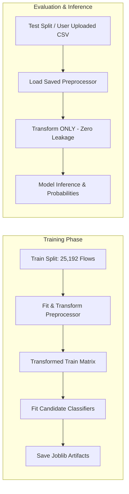

# Machine Learning Pipeline & Model Evaluation Methodology

## 1. Zero Data Leakage Architecture

A critical vulnerability in network intrusion detection literature is *data leakage*, wherein normalizer scalers, mean statistics, or categorical encoding vocabularies are learned across the entire dataset prior to splitting into train/test partitions.

In this system:
1. The **`NIDSPreprocessor`** is fitted **strictly and exclusively** on the training partition (`KDDTrain+.txt`, 25,192 records).
2. The held-out test partition (`KDDTest+.txt`, 22,544 records) and any user-uploaded inference files are strictly **transformed** using the stored pipeline object without re-fitting.

---

## 2. Preprocessing Components

The pipeline consists of:
- **`DataCleaner`**:
  - Coerces numerical columns, safely converting string corruptions or empty spaces to NaN.
  - Replaces `+np.inf` and `-np.inf` with NaN.
  - Strips whitespace and standardizes strings to lowercase.
- **`ColumnTransformer`**:
  - **Numerical Features (38 attributes)**:
    - `SimpleImputer(strategy='median')`: Robust against extreme traffic spikes and skewness.
    - `StandardScaler()`: Zero-mean, unit-variance scaling for convergence stability across regularized linear and tree splits.
  - **Categorical Features (3 attributes: `protocol_type`, `service`, `flag`)**:
    - `SimpleImputer(strategy='constant', fill_value='missing')`
    - `OneHotEncoder(handle_unknown='ignore', sparse_output=False)`: Encodes discrete network protocol identifiers while gracefully ignoring unseen protocol flags during inference without throwing unhandled exceptions.

---

## 3. Candidate Classifiers Evaluated

To prevent arbitrary algorithm selection, three classical algorithms are systematically trained and evaluated:

1. **Logistic Regression (`lbfgs`, max_iter=500)**:
   - High-speed linear baseline utilizing cross-entropy loss with L2 regularization.
2. **Random Forest Classifier (100 estimators, max_depth=16, random_state=42)**:
   - Non-linear ensemble of decision trees with feature sub-sampling. Resistant to overfitting on noisy connection headers.
3. **HistGradientBoostingClassifier (max_iter=100, max_depth=12, random_state=42)**:
   - Modern histogram-binned gradient boosting decision tree algorithm. Highly effective at capturing subtle multi-hop interactions and skewed feature thresholds with fast training speed.

---

## 4. Model Selection Criterion

In network security, selecting a model based purely on overall accuracy is fundamentally flawed due to class imbalance. In environments where normal traffic dominates 80-90% of connections, a trivial majority classifier achieves high accuracy while missing 100% of malicious intrusions.

Therefore, our automated selection criterion prioritizes:
$$\text{Selection Score} = \text{Macro } F_1\text{-Score}$$

$$\text{Macro } F_1 = \frac{1}{K} \sum_{k=1}^K F_1^{(k)}$$

The **Macro F1-Score** gives equal weight to all classes, heavily penalizing models that fail on minority attack vectors (such as remote-to-local and privilege escalation intrusions).
